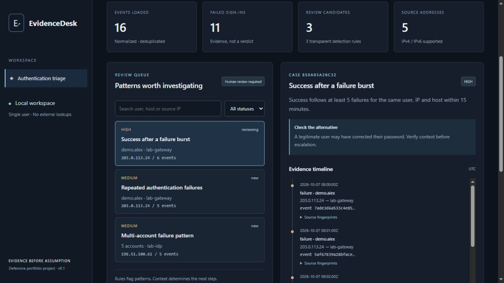

# EvidenceDesk

**Authentication evidence, organised for a defensible next step.**

A local Python / Flask / SQLite workspace for reviewing exported sign-in events. See why a pattern was flagged, inspect its supporting events and leave a case note that travels with the evidence.

**Import → validate → investigate → document → export.**

Three transparent rules · UTC timelines · source fingerprints · persistent review notes.

**Try it:** [install and run locally](#run-locally), then select **Load synthetic demo**. No account or API key needed.

[Validation](docs/VALIDATION.md) · [Architecture](#architecture-and-trade-offs) · [Interview walkthrough](INTERVIEW_NOTES.md)



## The problem

A failed login is easy to count and easy to misinterpret. Analysts need the surrounding events, the rule that raised the candidate, the source of each record and a note explaining what to check next. EvidenceDesk keeps those pieces together rather than presenting an unexplained risk score.

**v0.1 delivers one complete workflow:** import → validate → inspect → document → export.

* Strict UTF-8 CSV / JSONL imports with timezone-aware timestamps and IPv4 / IPv6 validation.
* Atomic ingestion: a bad event rejects the entire file. No partial evidence set.
* Canonical event deduplication across files, original-file SHA-256 fingerprints and event-to-file provenance.
* Three deterministic rules with explicit thresholds, supporting events and plausible benign alternatives.
* Searchable queue, review statuses, persistent investigation notes and a UTC timeline.
* Case JSON export containing full event and source fingerprints. Exported reports can contain sensitive information; handle them accordingly.
* Saved review snapshots survive late evidence that changes a finding's grouping.
* Synthetic demo included. No account, API key, telemetry or remote enrichment.

## Run locally

Requires Python 3.12 or newer. Clone or download this repository, then:

```bash
python -m venv .venv
# Linux / macOS
source .venv/bin/activate
# Windows PowerShell: .venv\Scripts\Activate.ps1
python -m pip install -e ".[dev]"
evidencedesk
```

Open **http://127.0.0.1:8765**. Select **Load synthetic demo**, open the success-after-failures candidate, review its six events, write a note and export the case. A second demo import adds zero events.

If script activation is restricted on Windows, use `.venv\Scripts\python.exe -m pip install -e ".[dev]"` and `.venv\Scripts\python.exe -m evidencedesk`; no execution-policy change is needed.

```bash
python -m evidencedesk --port 8766 --data-dir ./instance-lab
python -m pytest -q
python scripts/scan_secrets.py
```

The CLI binds only to `127.0.0.1` and serves through Waitress with one worker thread. Data is stored in `instance/evidencedesk.sqlite3` relative to the directory from which you start the app. Stop with Ctrl+C. Keep the data directory on an access-controlled local disk; it is not encrypted by this application.

Dependency ranges live in `pyproject.toml`; `requirements-tested.txt` records the exact environment used for validation. To reproduce it, install that file before the editable package. Installation needs access to the Python package registry; the running app does not.

## Input contract

```csv
timestamp,user,source_ip,host,outcome,log_source
2026-10-07T08:00:00Z,demo.alex,203.0.113.24,lab-gateway,failure,synthetic-demo
```

The first five columns are required; `log_source` is optional. `outcome` must be `success` or `failure`. Every timestamp needs an explicit timezone. Text fields are capped at 160 characters and reject control characters. Unknown fields and duplicate headers are rejected. JSONL uses the same keys, one object per line. Maximum: **2 MiB / 20,000 events per file; 50,000 unique events per workspace**.

Map a Windows, Linux or cloud export to this schema before import. There is no native Event ID, syslog or provider-specific adapter in this release. Canonical records with identical values, including timestamp and source label, collapse into one event; this is useful for repeat exports but can collapse indistinguishable genuine events. Original file bytes are fingerprinted, **not retained**. Keep original logs separately if your process requires them. The sample uses reserved documentation addresses and fictional identities only.

## How candidates are detected

| Rule | Scope and inclusive threshold | Important alternative |
| --- | --- | --- |
| Repeated failures | Same user + IP + host; 5 failures / 10 minutes | Saved credentials or typing mistakes |
| Success after failures | Same user + IP + host; success after 5 failures / 15 minutes | A legitimate password correction |
| Multi-account failures | Same IP + host; 5 distinct users / 20 minutes | Shared egress or broken identity integration |

Failures are evaluated in chronological order. Five-failure episodes and multi-account episodes produce bounded evidence groups. A success resets that user/IP/host failure episode. Severity is a fixed review priority, **not confidence or proof of compromise**. Rules are intentionally visible in [`rules.py`](evidencedesk/rules.py).

Findings use a hash of the rule name and evidence IDs. Appending later events preserves completed groups; importing older events can change the grouping. Saved reviews retain their original evidence snapshot and are labelled accordingly. Events sharing the exact timestamp are ordered by canonical ID, so causality cannot be inferred from equal timestamps.

## Architecture and trade-offs

```text
Browser (plain JavaScript, safe text rendering)
    ↕ local HTTP + session CSRF token
Flask routes / validation / security headers
    ├─ ingest.py   → canonical validation + event identity
    ├─ rules.py    → deterministic, bounded-window candidates
    └─ storage.py → transactional SQLite + provenance + case snapshots
```

Python and SQL keep the logic inspectable. SQLite removes a separate database service; plain JavaScript avoids a frontend build pipeline. Rules are recomputed from the bounded local evidence set rather than maintained as a distributed streaming engine. That favours clarity and repeatability at this scale; it does not support a production SOC workload.

The design work centred on three lessons: reject ambiguous timestamps before correlating events; distinguish a content fingerprint from source authenticity; and preserve an analyst's prior review when later evidence changes the grouping. Those decisions are explained in [`INTERVIEW_NOTES.md`](INTERVIEW_NOTES.md), including a Turkish walkthrough.

## Security and limits

This is a **single-user local tool without authentication**. Do not expose it to a network or run it as a shared service. Local host validation, same-origin write checks, CSRF tokens, parameterised SQL, input limits, safe DOM text rendering and a restrictive Content Security Policy reduce specific risks; they do not provide multi-user isolation. Any process or person with access to your local session or disk may access the evidence. See [`SECURITY.md`](SECURITY.md).

It does not ingest live traffic, contact target systems, validate log signatures, identify a person behind an IP, run commands from logs, block accounts or replace a SIEM. It has been tested against synthetic data and boundary cases, not production incidents. There are no claimed detection accuracy metrics.

## Validation and next milestone

Automated tests cover invalid input, timezone conversion, window boundaries, benign non-matches, deduplication, atomicity, case persistence, late evidence, CSRF/origin/host protections and report handling. The screenshot above comes from the running app; the demo is labelled synthetic. Browser checks and exact results are recorded in [`docs/VALIDATION.md`](docs/VALIDATION.md).

The next milestone is one well-tested Windows authentication export adapter with an explicit mapping preview. After that: configurable thresholds with versioned rule metadata, audited note history, performance profiling and retention controls. Cloud-provider adapters are future work, not current capabilities.

## Project context

EvidenceDesk is Nuhsamet Arslan's defensive portfolio project. The public code, demo, validation record and design notes make its behaviour and decisions inspectable.

The project choice was informed by SOC role responsibilities: first-level log review, contextual investigation and documented escalation. Sources and role-fit constraints are recorded in [`docs/PROJECT_BRIEF.md`](docs/PROJECT_BRIEF.md).

## Development note

AI tools supported implementation, review, testing and documentation.

## Licence

MIT licence applies to this repository's source. Review and test it for your own authorised use.
